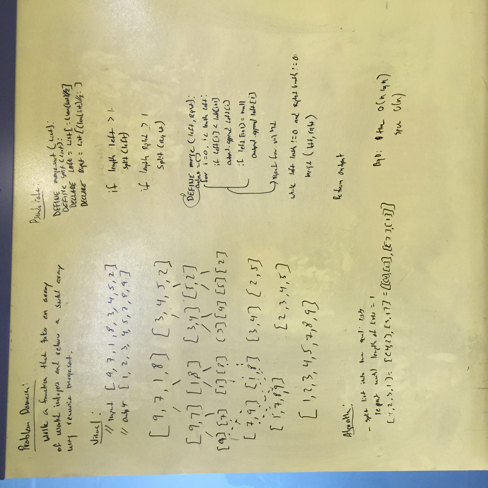

# Whiteboard 36 MergeSort

**Author**: 
- Keith Eckert [Git Hub](https://github.com/keitheck) | [Linkedin](www.linkedin.com/in/keith-eckert)

**Version**: 0.1.0

## Overview
- Write a function that accepts an array of unsorted integers, and returns a sorted array by a recursive mergesort algorithm.

## Architecture
Written using Python 3.6

## Change Log
| Date | |
|:--|:--|
| 7 May 2018 | written and tested|

## Resources
- Python 3.6
- iPython

## Pytest## Whiteboard Photo

