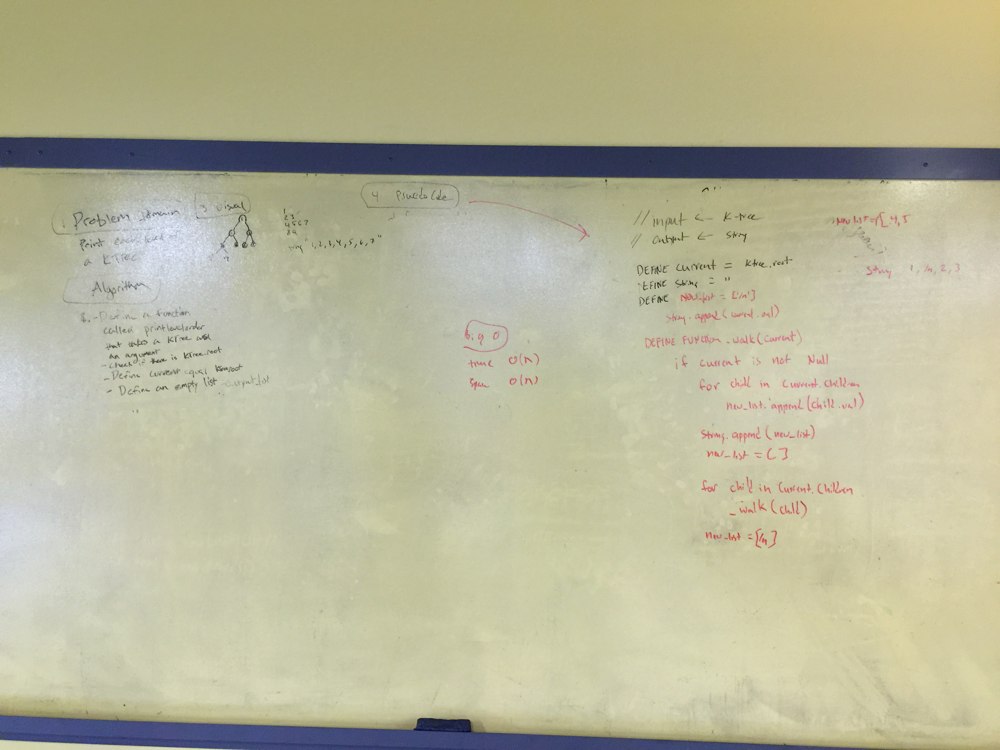

# Whiteboard Challenge 27 | Write a function to generate a level-order printout of a k-ary tree

# Technologies
- Python 3

# Task

- Write a function which takes in a k-ary tree. Without utilizing any of the built-in methods available to your language, return a string that contains a listing of all values in the tree, with new lines in-between each level of the tree.

## Whiteboard

