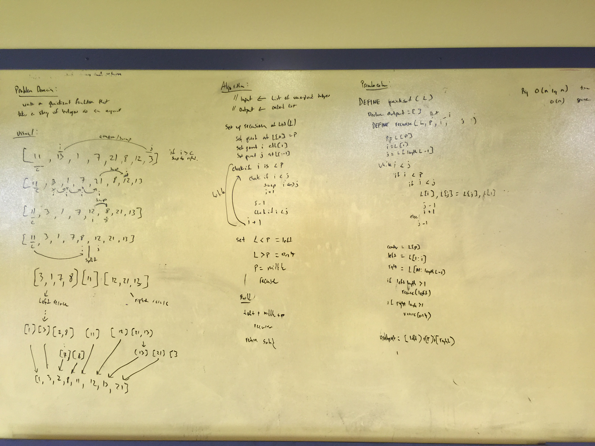

# Whiteboard 37 Quicksort

**Author**: 
- Keith Eckert [Git Hub](https://github.com/keitheck) | [Linkedin](www.linkedin.com/in/keith-eckert)

**Version**: 0.1.0

## Overview
- Write a function that accepts an array of positive/negative integers and floats and returns an array sorted by a recursive quicksort algorithm.

## Architecture
Written using Python 3.6

## Change Log
| Date | |
|:--|:--|
| 8 May 2018 | scaffold |
| 13 May 2013 | written and tested |

## Resources
- Python 3.6
- iPython

## Pytest## Whiteboard Photo
