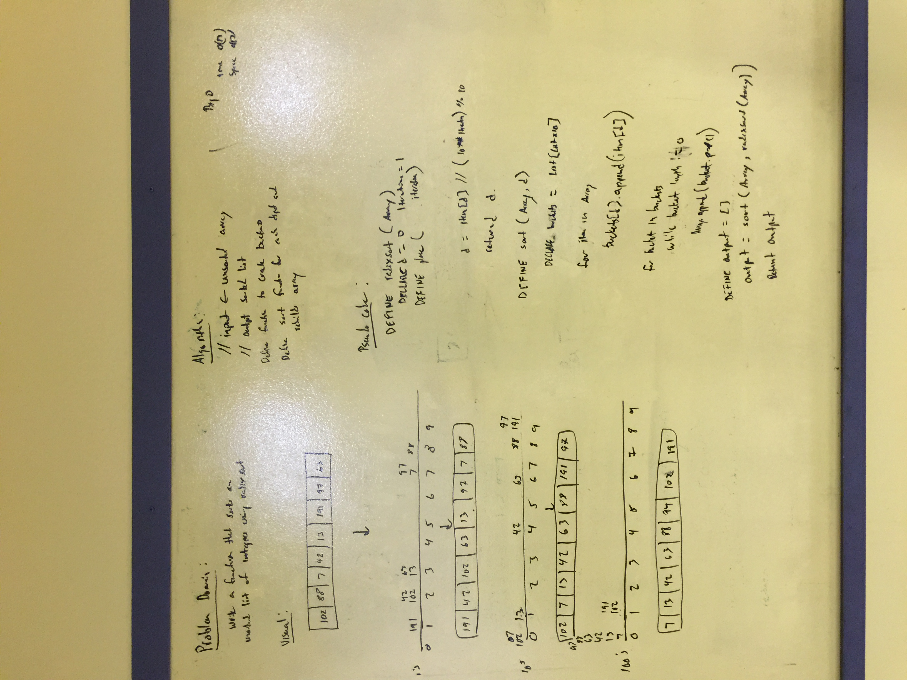

# Whiteboard 38 Radix Sort

**Author**: 
- Keith Eckert [Git Hub](https://github.com/keitheck) | [Linkedin](www.linkedin.com/in/keith-eckert)

**Version**: 0.1.0

## Overview
- Write a function that accepts an array of positive integers, and returns an array sorted by a radix sort algorithm.

## Architecture
Written using Python 3.6

## Change Log
| Date | |
|:--|:--|
| 9 May 2018 | written and tested|

## Resources
- Python 3.6
- iPython

## Pytest## Whiteboard Photo

