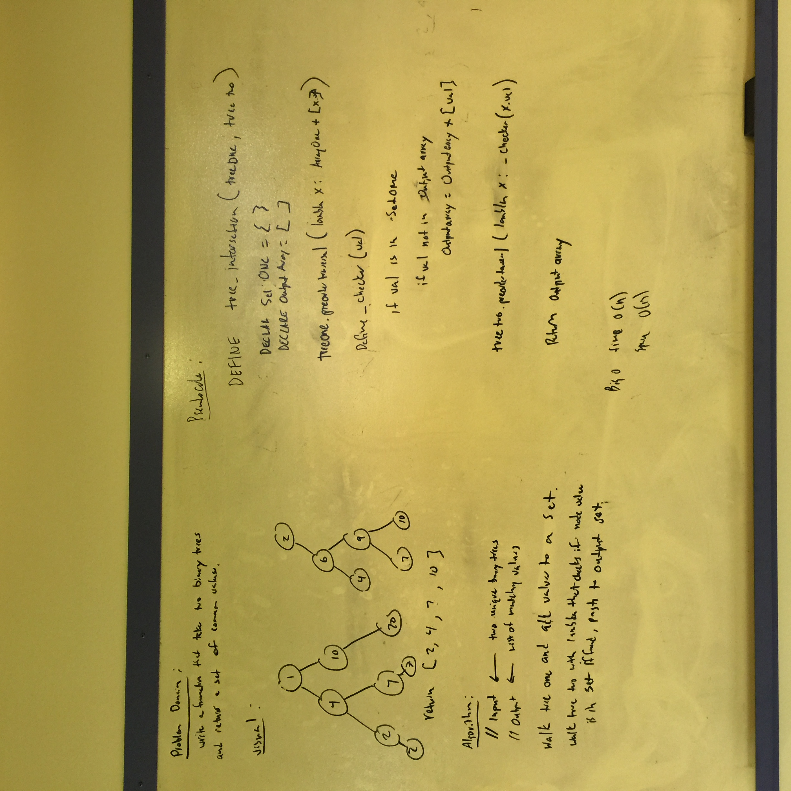

# Class 32 Tree Intersection

**Author**: 
- Keith Eckert [Git Hub](https://github.com/keitheck) | [Linkedin](www.linkedin.com/in/keith-eckert)

**Version**: 0.1.0

## Overview
- Write a function called tree_intersection that takes two binary tree parameters.
- Without utilizing any of the built-in library methods available to your language, return a set of values found in both trees.

## Architecture
Written using Python 3.6

## Change Log
| Date | |
|:--|:--|
| 1 May 2018 | written and tested 100% coverage |

## Resources
- Python 3.6
- iPython
- Pytest

## Photo
